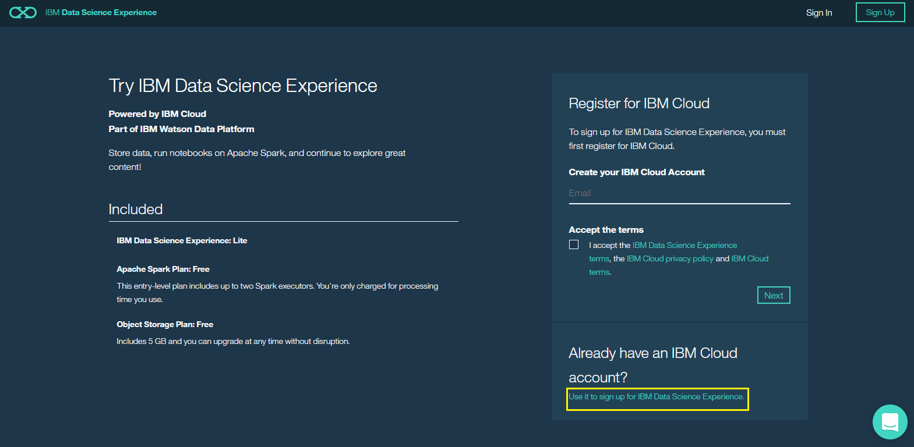
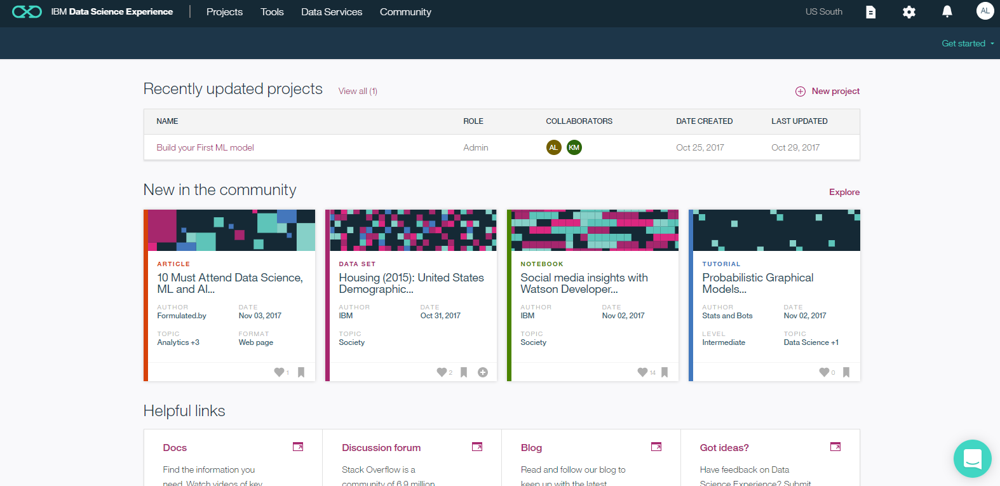
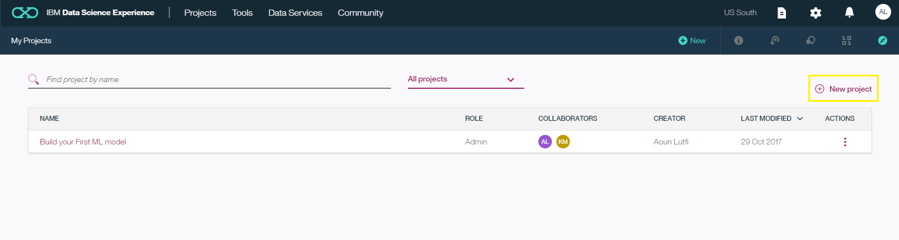
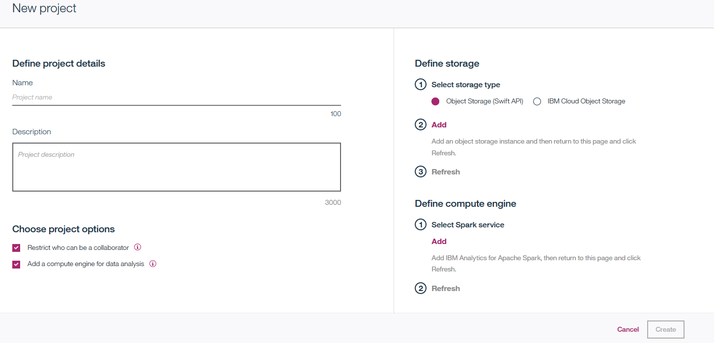
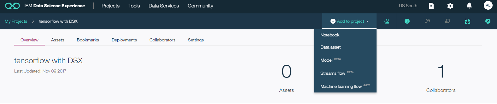
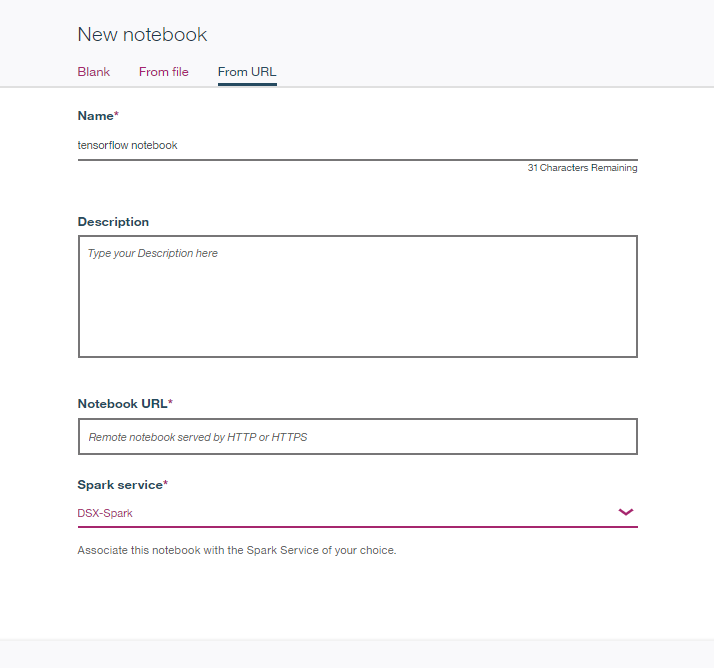
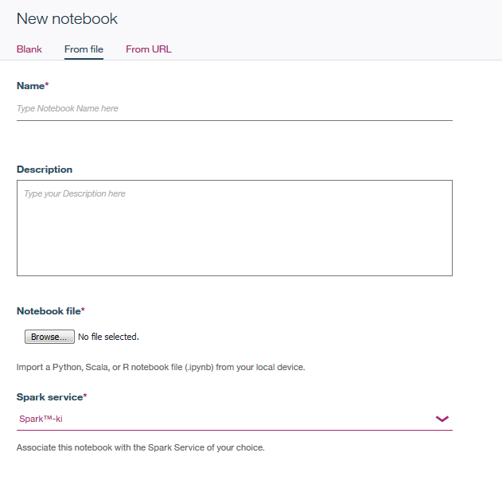
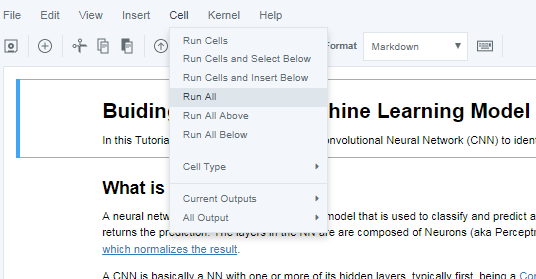
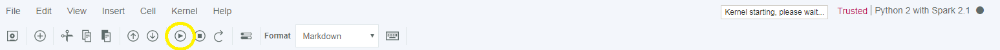
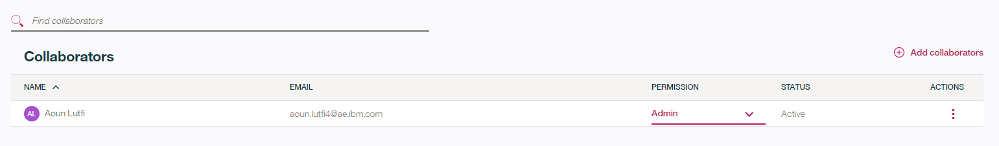

The challenge with deploying complex machine learning models is that these models are very computationally expensive and time-consuming to train. Some solutions include GPU acceleration, distributed computing, or a combination of both. [IBM Cloud](https://www.ibm.com/cloud/) offers both solutions. In this guide, you will deploy a deep neural network (using Tensorflow) on [IBM Data Science Experience](https://datascience.ibm.com/) (DSX) to speed up the process of training the model. DSX allows you to leverage the computational power available on the cloud to speed up the training time of the more complex machine learning models, and thus reducing the time from hours or days, down to minutes.

### Data Science Experience

IBM's Data Science Experience (DSX) is a data science platform that provides all the tools necessary to develop a data-centric solution on the cloud. It makes use of Apache Spark clusters to provide the computational power needed to develop complex machine learning models. You can choose to create assets in Python, Scala, and R, and leverage open source frameworks (such as TensorFlow) that are already installed on DSX.

## Objective

The goal of this tutorial is to import and run through a Jupyter notebook written in Python on IBM's Data Science Experience. With DSX, you will take advantage of the distributed computing capabilities of Apache Spark and deploy the model in Python. We begin by signing up to DSX, creating a new project in DSX, importing the notebook, and finally, running the notebook. 

### Prerequisite: Sign up for IBM Cloud and IBM Data Science Experience

Before we begin, we have to [create a new IBM Cloud account](https://console.bluemix.net/registration), if you haven't already. Additionally, we have to sign up for [IBM Data Science Experience](https://datascience.ibm.com). This gives us access to an interactive, collaborative, cloud-based environment.

1. In a web browser, navigate to [https://datascience.ibm.com](https://datascience.ibm.com).

2. Click on **Sign Up** at the top right.

3. Click on **Sign in with your IBM id** and enter your IBM Cloud credentials.

4. Follow the instructions to complete the sign up for IBM Data Science Experience. As soon as the _Get Started_ button is enabled, click it and you should be directed to the Data Science Experience dashboard as shown below.

**note that if your IBM Cloud account is set up in the UK, you will have to navigate to [https://eu-gb.datascience.ibm.com](https://eu-gb.datascience.ibm.com).**

## Navigating IBM's Data Science Experience to create a Notebook

### Create a new project

1. Click on the _Projects_ tab to see a list of your projects. You should only see a default project.

2. Click on the create project icon on the top right of the project list. 

3. Type a name for your project. For instance, "ML Model". Create a new Spark Service and Object Storage Service as indicated on the screen. A container is a collection of objects used for object storage. Click on _Create_ to create the new project. Once created, you will be directed to your new project where you can create notebooks, import data assets, or add collaborators.

### Create a new notebook

1. From the newly created project dashboard, click the _Add to project_ option and select _Notebook_.

2. You can create a new, empty notebook or specify to import an existing one, either from a file or from a known URL. 

### Run the notebook

1. To run the notebook, click on _Cell_ from the _Commands_ ribbon, and then click _Run all cells_. DSX will then run all the code snippets in the notebook. The notebook takes around 15 minutes to run since the data set is made up of 20,000 images.

Alternatively, you can run a single cell by selecting the _Play_ icon from the menu, highlighted below.

### What else can I do?

DSX is more than just a development platform. It is also a community-driven and collaboration platform. With DSX you can share a project with other users and collaborate on a specific notebook. You can also benefit from  [community created content](https://dataplatform.ibm.com/community) that includes free notebooks and data sets. See the image below for how to add collaborators to a project.

## Conclusion

After completing the steps above, you are able to deploy models from frameworks such as `Sklearn`, `Spark MLLib`, `tensorflow` or any other library on DSX. You can then try to set up Python on your personal computer and run the code on your machine to compare the results. It might take hours, maybe days to train, depending on the performance of your machine and complexity of the model..
